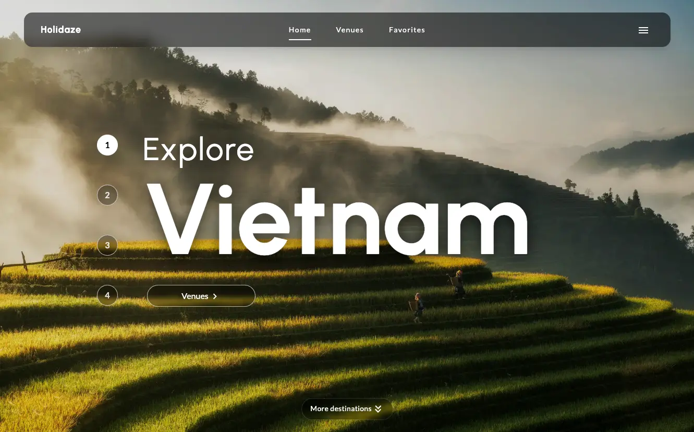

# Holidaze - Project Exam 2



**Holidaze** is a booking application where users can register, log in, create and manage bookings, and become a venue manager to create and manage venues. The application is built with **React, TypeScript and Tailwind CSS**, and interacts with the **Noroff Holidaze API**.

## Description

Holidaze was created as my submission for **Project Exam 2** at Noroff.

### Features

The website includes the following features:

Public

- Browse and search venues
- View detailed venue pages
- Save and manage favorite venues (localStorage)
- Login and register

Authenticated

- Manage profile
- Create, edit and delete bookings
- View and manage upcoming bookings

Authenticated Manager

- Create, update and delete venues

## Design

- Modern UI with glass effects and soft shadows
- Full-screen hero section with different destinations
- Responsive layout

## Tech Stack

- **Core:** React, TypeScript, Tailwind CSS
- **API:** Noroff Holidaze API (v2)
- **Tools:** Vite, Prettier, ESLint, Netlify
- **Other:** react-day-picker, react-hot-toast, zod, mui icons

## Architecture

- Reusable UI components (Button, Input, Textarea, ModalWrapper, LoadingLine +)
- API client for all network requests
- Form validation using Zod schemas
- Protected routes using AuthGuard and ManagerGuard
- SafeImage component for image fallbacks
- LocalStorage based favorites system
- User feedback with toast notifications

## Getting Started

### Usage

- Browse all venues without logging in.
- Use the search bar to search for venues (name and description)
- Register with a @stud.noroff.no email to create an account.
- Logged-in users can:
  - Create, update and delete bookings to venues.
  - Be a venue manager and create, update and delete venues.
  - Edit their profile avatar and bio.

### Installing

To get a local copy of the project up and running:

1. Clone the repository:

```bash
git clone https://github.com/Martinekong/fed2-pe2.git
```

2. Install dependencies

```bash
npm install
```

3. Create a `.env` file in the root of the project and add the following environment variables (see `.env.example`):

```env
VITE_API_BASE_URL=https://v2.api.noroff.dev
VITE_API_KEY=your_api_key_here
```

4. Start the local dev server:

```bash
npm run dev
```

## Live Demo

This site is deployed using Netlify:  
🔗 [Holidaze website](https://martine-holidaze.netlify.app/)

## Contributing

Contributions are welcome!
If you’d like to contribute:

1. Fork the repository.
2. Create a new branch: `git checkout -b feature/your-feature`.
3. Commit your changes: `git commit -m 'Add some feature'`.
4. Push to the branch: `git push origin feature/your-feature`.
5. Open a Pull Request.

Please ensure your code follows the existing style (Prettier is included).

## Contact

If you have any questions or feedback, feel free to reach out:

- [LinkedIn](https://www.linkedin.com/in/martine-kongsrud)
- Email: [martinekongsrud@outlook.com](mailto:martinekongsrud@outlook.com)

## Acknowledgments

Huge thanks to:

- Noroff for providing the project guidelines and Holidaze API.
- MUI icons, react-hot-toast and react-day-picker.
- Netlify for streamlining the development and deployment process.
